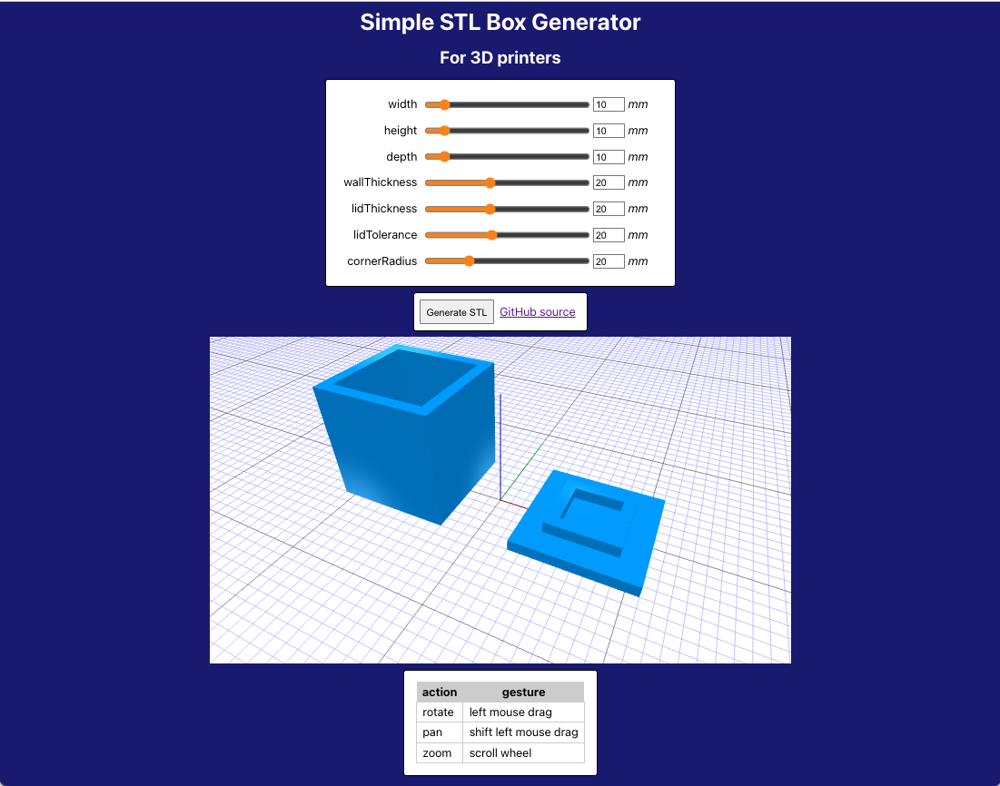

# make 3d printable boxes

Web GUI tool to generate STLs of boxes with lids for 3D printing.

See [the live app here](https://apps.josh.earth/boxbuilder/)

# How it works

The core of the code is pretty simple. 
* It's a React app with sliders made with [create-react-app](https://create-react-app.dev).
* The fancy math is done with [JSCad libraries](https://github.com/jscad/OpenJSCAD.org).
* Sliders modify a small data model of the box.
* When model changes it calls box_to_solids() to produce JSCad geometry solids.
* [jscad-react](https://github.com/kenianbei/jscad-react) does the interactive 3D rendering (presumably with ThreeJS underneath).
* export_stl() uses a [JSCad serializer](https://www.npmjs.com/package/@jscad/stl-serializer) to generate the STL as a binary blob
* force download the blob as box.stl.
